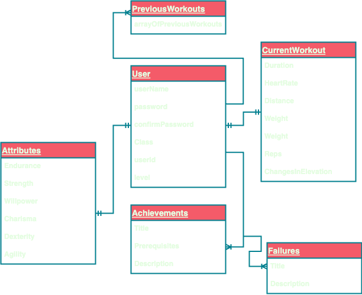
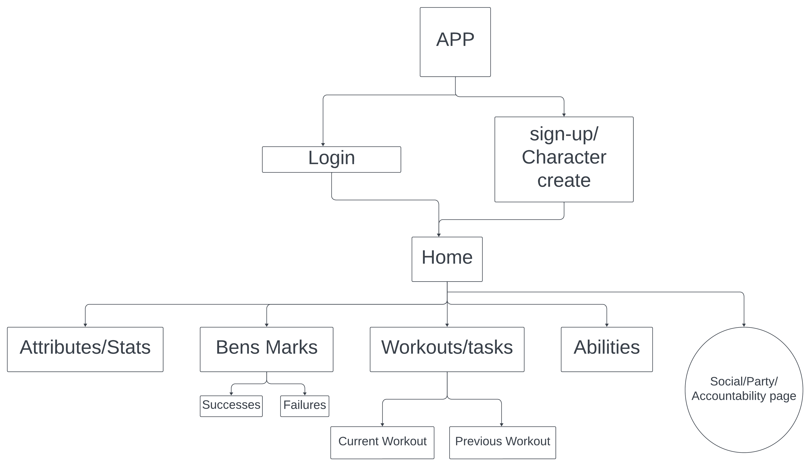

# DungeonFit

## Wire Frame

## Component Hierarchy Diagram

## Links
- Trello: https://trello.com/b/R4ppz8w4/fitness-app-mern-group-project
- FIGMA: https://www.figma.com/file/pCAt3iDl9pmNcsMPxOR3he/Untitled?type=design&node-id=3%3A6&mode=design&t=KEiVHoMrZzb8oixN-1

## Description
- A goals driven Fitness Tracker App that encourages fitness with a gaming influence,
- Class System: Build your character.
- Achievement System that rewards users on commitment and drive.
- Accountability System split between three levels: App, User and Community.
 Community 

## Character Creation
01. Name/Pronouns/
02. Class
03. Attributes

## Attributes
01. Endurance
02. Strength
03. Willpower
04. Charisma
05. Dexterity
06. Agility

## Bens Mark
01. Achievements
02. Opportunities

## Accountability
01. App Defined
02. User Defined
03. Community Defined

## Socials
01. Kyndal LoCascio
02. Ben Whittaker
03. Rob Castor

## Technologies
01. HTML
02. CSS
03. React
04. Mongoose
05. Express
06. Node